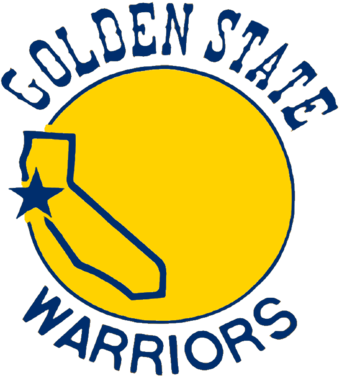
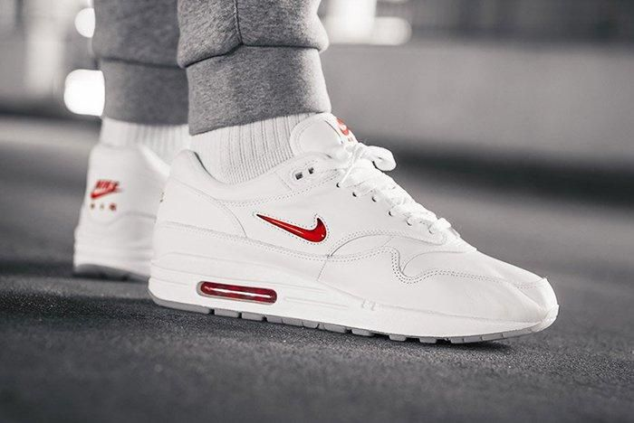

# Shane Valderrama

### About Me
I am a first generation Peruvian-Mexican, Computer Engineering major. I was born and raised in the San Francisco Bay Area. In my free time, I usually like to read, cook, and play basketball. I'm a bit of a gym rat, so I maintain a healthy diet and workout regularly. Before committing to college, I wanted to become a chef so I would like to attend culinary school at some point in time after graduation. As of recently, I've become somewhat of a sneakerhead and have been building up quite a collection. For as long as I can remember, I've always loved cartoons so I would really like to get into animation.  

### Technical Skills
* Java
* C
* C++
* Python

### Favorites

Basketball Team:

Sneaker Pair:

Check out my music taste on my [Spotify](https://open.spotify.com/collection/tracks).
